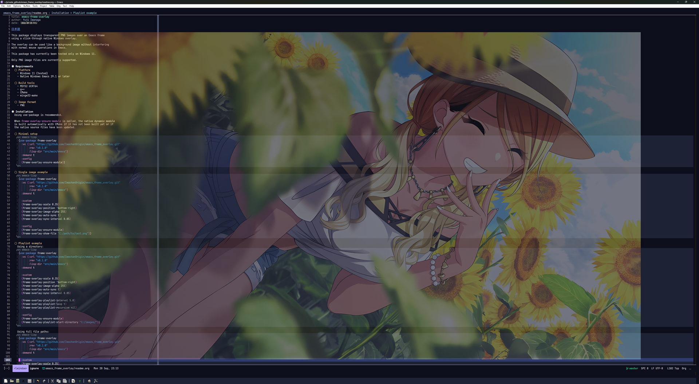

#+title: emacs-frame-overlay
#+author: Yuji Iwanaga
#+date: <2026-09-25 Fri>

[[file:readme.org][ENGLISH]]

このパッケージは、Windowsのネイティブオーバーレイによるクリックスルー機能を利用して、
Emacsのフレーム上に透明なPNG画像を表示します。

オーバーレイされたウィンドウは、Emacsでの通常のマウス操作に影響を与えず、
背景画像のように使用することができます。

このパッケージは、Windows 11 でのみ動作確認を行っています。

現在、PNG形式の画像ファイルのみサポートしています。

* Demo
https://github.com/user-attachments/assets/c9da1669-1183-4221-a437-742647dd4819

* 要件
** プラットフォーム
- Windows 11 (tested)
- Native Windows Emacs 29.1 or later

** ビルドツール
- MSYS2 UCRT64
- g++
- CMake
- mingw32-make

** 画像形式
- PNG

* 使い方
「use-package」の使用をお勧めします。

=frame-overlay-ensure-module= が呼び出されると、ネイティブのダイナミックモジュールが
まだビルドされていない場合、またはネイティブのソースファイルが更新された場合、CMake によって自動的にビルドされます。

** ネイティブモジュールの読み込みまで行う設定
#+begin_src emacs-lisp
(use-package frame-overlay
  :vc (:url "https://github.com/IwachanOrigin/emacs_frame_overlay.git"
       :rev "v0.2.0"
       :lisp-dir "src/main/emacs")
  :demand t
  :config
  (frame-overlay-ensure-module))
#+end_src

** 単一画像設定例
固定倍率で表示する場合:
#+begin_src emacs-lisp
  (use-package frame-overlay
    :vc (:url "https://github.com/IwachanOrigin/emacs_frame_overlay.git"
         :rev "v0.2.0"
         :lisp-dir "src/main/emacs")
    :demand t

    :custom
    (frame-overlay-size-mode 'fixed)
    (frame-overlay-scale 0.35)
    (frame-overlay-position 'bottom-right)
    (frame-overlay-image-alpha 255)
    (frame-overlay-auto-sync t)
    (frame-overlay-sync-interval 0.05)

    :config
    (frame-overlay-ensure-module)
    (frame-overlay-show-file "C:/path/to/test.png"))
#+end_src

Emacs Frameのサイズに合わせて自動リサイズする場合:
#+begin_src emacs-lisp
  (use-package frame-overlay
    :vc (:url "https://github.com/IwachanOrigin/emacs_frame_overlay.git"
         :rev "v0.2.0"
         :lisp-dir "src/main/emacs")
    :demand t

    :custom
    (frame-overlay-size-mode 'fit)
    (frame-overlay-frame-ratio 0.90)
    (frame-overlay-position 'bottom-right)
    (frame-overlay-image-alpha 255)
    (frame-overlay-auto-sync t)
    (frame-overlay-sync-interval 0.05)

    :config
    (frame-overlay-ensure-module)
    (frame-overlay-show-file "C:/path/to/test.png"))
#+end_src

** プレイリスト画像設定例
ディレクトリ内の画像ファイル群:
#+begin_src emacs-lisp
(use-package frame-overlay
  :vc (:url "https://github.com/IwachanOrigin/emacs_frame_overlay.git"
       :rev "v0.2.0"
       :lisp-dir "src/main/emacs")
  :demand t

  :custom
  (frame-overlay-scale 0.35)
  (frame-overlay-position 'bottom-right)
  (frame-overlay-image-alpha 255)
  (frame-overlay-auto-sync t)
  (frame-overlay-sync-interval 0.05)

  (frame-overlay-playlist-interval 5.0)
  (frame-overlay-playlist-loop t)
  (frame-overlay-playlist-recursive nil)

  :config
  (frame-overlay-ensure-module)
  (frame-overlay-playlist-start-directory "C:/images/"))
#+end_src

画像ファイルのフルパスを列挙してプレイリスト再生する設定:
#+begin_src emacs-lisp
(use-package frame-overlay
  :vc (:url "https://github.com/IwachanOrigin/emacs_frame_overlay.git"
       :rev "v0.2.0"
       :lisp-dir "src/main/emacs")
  :demand t

  :custom
  (frame-overlay-scale 0.35)
  (frame-overlay-position 'bottom-right)
  (frame-overlay-image-alpha 255)
  (frame-overlay-auto-sync t)
  (frame-overlay-sync-interval 0.05)

  (frame-overlay-playlist
   (list "C:/images/a.png"
         "C:/images/b.png"
         "C:/images/c.png"))

  (frame-overlay-playlist-interval 5.0)
  (frame-overlay-playlist-loop t)

  :config
  (frame-overlay-ensure-module)
  (frame-overlay-playlist-start))
#+end_src

画像をEmacs Frameのサイズに合わせて自動リサイズする場合は、
=frame-overlay-size-mode= に =fit= を指定し、
=frame-overlay-frame-ratio= でFrameに対する最大表示割合を設定できます。

** NOTE
ビルドに使用するソフトウェアが、Emacs上から見つかることを確認してください。

#+begin_src emacs-lisp
  (executable-find "cmake")
  (executable-find "g++")
  (executable-find "mingw32-make")
#+end_src

* 設定
** 基本設定例
#+begin_src emacs-lisp
  (setq frame-overlay-scale 0.35)
  (setq frame-overlay-position 'bottom-right)
  (setq frame-overlay-image-alpha 255)
  (setq frame-overlay-auto-sync t)
  (setq frame-overlay-sync-interval 0.05)
  (setq frame-overlay-playlist-directory "C:/images/")
  (setq frame-overlay-playlist-interval 5.0)
  (setq frame-overlay-playlist-loop t)
  (setq frame-overlay-playlist-recursive nil)
  (setq frame-overlay-verbose nil)
#+end_src

** 単一画像設定例
#+begin_src emacs-lisp
  (frame-overlay-show-file "C:/path/to/test.png")
#+end_src

** プレイリスト画像設定例
ディレクトリ内の画像ファイル群

#+begin_src emacs-lisp
  (frame-overlay-playlist-start-directory "C:/images/")
#+end_src

画像ファイルのフルパス

#+begin_src emacs-lisp
  (setq frame-overlay-playlist
        (list "C:/images/a.png"
              "C:/images/b.png"
              "C:/images/c.png"))
#+end_src

* API
** Image Configuration
*** frame-overlay-scale
**** Usage
#+begin_src emacs-lisp
  (setq frame-overlay-scale 0.35)
#+end_src

**** Description
#+begin_example
PNG画像の表示倍率を指定します。
この設定は frame-overlay-size-mode が fixed の場合に使用されます。
1.0 が原寸です。

1.0  = 100%
0.5  = 50%
0.35 = 35%
0.25 = 25%

デフォルト値は1.0です。
#+end_example

*** frame-overlay-size-mode
**** Usage
#+begin_src emacs-lisp
  (setq frame-overlay-size-mode 'fixed)
#+end_src

**** Description
#+begin_example
PNG画像の表示サイズを決定する方法を指定します。
指定可能な値:

fixed
  frame-overlay-scale を使用して固定倍率で表示します。

fit
  Emacs Frameのclient areaのサイズに合わせて画像を自動的に拡大・縮小します。
  画像のアスペクト比は維持されます。

fit の場合、Frameのサイズが変更されると、Overlay画像とOverlay Windowのサイズも自動的に追従します。
また、fit では、画像を元のサイズより大きく拡大しません。

デフォルト値は fixed です。
#+end_example

*** frame-overlay-frame-ratio
**** Usage
#+begin_src emacs-lisp
  (setq frame-overlay-frame-ratio 0.35)
#+end_src

**** Description
#+begin_example
frame-overlay-size-mode が fit の場合に、
画像がEmacs Frame内で使用できる最大サイズの割合を指定します。

指定可能な範囲は0より大きく1.0以下です。

例えば0.35を指定した場合、
画像はFrameのclient areaの幅・高さそれぞれ35%以内に収まるように
アスペクト比を維持してリサイズされます。

Frameのサイズが変更された場合も、この割合を基準に表示サイズが再計算されます。
この設定は frame-overlay-size-mode が fit の場合のみ使用されます。

デフォルト値は 0.35 です。
#+end_example

*** frame-overlay-position
**** Usage
#+begin_src emacs-lisp
  (setq frame-overlay-position 'bottom-right)
#+end_src

**** Description
#+begin_example
Frame内での画像の表示位置を指定します。
デフォルト値は`bottom-right`です。
指定可能な値:

top-left
top-right
bottom-left
bottom-right
center

配置イメージ:
top-left                 top-right
+--------------------+   +--------------------+
| IMAGE              |   |              IMAGE |
|                    |   |                    |
|                    |   |                    |
+--------------------+   +--------------------+

bottom-left              bottom-right
+--------------------+   +--------------------+
|                    |   |                    |
|                    |   |                    |
| IMAGE              |   |              IMAGE |
+--------------------+   +--------------------+

center
+--------------------+
|                    |
|       IMAGE        |
|                    |
+--------------------+
#+end_example

*** frame-overlay-margin-x
**** Usage
#+begin_src emacs-lisp
  (setq frame-overlay-margin-x 24)
#+end_src

**** Description
#+begin_example
横方向の余白をピクセル単位で指定します。

top-left や bottom-left の場合は左端からの距離、
top-right や bottom-right の場合は右端からの距離になります。

デフォルト値は`24`です。
#+end_example

*** frame-overlay-margin-y
**** Usage
#+begin_src emacs-lisp
  (setq frame-overlay-margin-y 24)
#+end_src

**** Description
#+begin_example
縦方向の余白をピクセル単位で指定します。

上側配置では上端からの距離、
下側配置では下端からの距離になります。

デフォルト値は`24`です。
#+end_example

*** frame-overlay-image-alpha
**** Usage
#+begin_src emacs-lisp
  (setq frame-overlay-image-alpha 255)
#+end_src

**** Description
#+begin_example
画像全体の透明度を指定します。
範囲は 0 ～ 255 です。

255 = 透過しない
128 = 約50%
96  = かなり薄い
64  = 控えめ
32  = 非常に薄い
0   = 完全透明

emacs上で適用しているテーマの色によって、画像透過時の目立ち方が変化します。
テーマがダークテーマに近い場合、黒画像は目立ちにくく、白画像は際立ちます。
ライトテーマに近い場合、黒画像は際立ち、白画像は目立ちにくくなります。

編集領域の中央に置く場合は、32 前後にするとコーディングの邪魔にならないように感じます。
なお、この値はPNGが元々持っているalpha値とは別です。

最終的な透明度は概念的には、
PNG本来のalpha
    ×
frame-overlay-image-alpha

として適用されます。

そのため、PNGの透明背景はそのまま透明です。
デフォルト値は`255`です。
#+end_example

*** frame-overlay-auto-sync
**** Usage
#+begin_src emacs-lisp
  (setq frame-overlay-auto-sync t)
#+end_src

**** Description
#+begin_example
Emacs Frameを移動・リサイズしたときに、Overlayを自動追従させるかを指定します。
無効時はnilを設定します。
現在はWin32イベントを直接監視する方式ではなく、Emacsのtimerを使って定期的に位置を更新しています。
デフォルト値は`t`です。
#+end_example

*** frame-overlay-sync-interval
**** Usage
#+begin_src emacs-lisp
  (setq frame-overlay-sync-interval 0.05)
#+end_src

**** Description
#+begin_example
自動追従の更新間隔を秒単位で指定します。

0.05 = 50ms  = 約20回/秒
0.10 = 100ms = 約10回/秒
0.25 = 250ms = 約4回/秒

値を小さくすると追従が滑らかになりますが、同期処理の呼び出し回数は増えます。
デフォルト値は `0.05` です。
#+end_example

** Image operations
*** frame-overlay-show-file
**** Usage
#+begin_src emacs-lisp
  (frame-overlay-show-file "C:/path/to/test.png")
#+end_src

**** Description
#+begin_example
指定したPNG画像を現在のEmacs Frame上に表示します。
内部では以下のような処理を行っています。
PNG読み込み
  ↓
WICでdecode
  ↓
32bit PBGRAへ変換
  ↓
frame-overlay-size-mode にしたがって表示サイズを決定
  ↓
画像をリサイズ
  ↓
UpdateLayeredWindow
  ↓
Frame上へ透過表示

PNGが持っている透明部分はそのまま透過されます。
また、Overlayはマウス操作を透過するため、画像の上をクリックしても背面のEmacsを操作できます。
#+end_example

*** frame-overlay-refresh
**** Usage
#+begin_src emacs-lisp
  (frame-overlay-refresh)
#+end_src

**** Description
#+begin_example
現在表示中のPNG画像を、現在の設定値で再読み込み・再表示します。

frame-overlay-scale
frame-overlay-size-mode
frame-overlay-frame-ratio
frame-overlay-position
frame-overlay-margin-x
frame-overlay-margin-y
frame-overlay-image-alpha

などを変更した後、この関数を実行すると表示へ反映されます。

プレイリスト再生中に実行しても、プレイリストの再生は停止しません。
#+end_example
*** frame-overlay-hide
**** Usage
#+begin_src emacs-lisp
  (frame-overlay-hide)
#+end_src

**** Description
#+begin_example
オーバーレイ画像を隠します。
プレイリスト再生とFrameの自動追従を停止します。
#+end_example

*** frame-overlay-destroy
**** Usage
#+begin_src emacs-lisp
  (frame-overlay-destroy)
#+end_src

**** Description
#+begin_example
Overlay Windowを破棄し、読み込んでいる画像のネイティブリソースも解放します。
プレイリスト再生とFrameの自動追従も停止します。
#+end_example

*** frame-overlay-sync-now
**** Usage
#+begin_src emacs-lisp
  (frame-overlay-sync-now)
#+end_src

**** Description
#+begin_example
手動で現在の位置へ画像の座標を合わせます。
#+end_example

** Playlist configuration
*** frame-overlay-playlist
**** Usage
#+begin_src emacs-lisp
  (setq frame-overlay-playlist
        (list "C:/images/a.png"
              "C:/images/b.png"
              "C:/images/c.png"))
#+end_src

**** Description
#+begin_example
複数の画像を設定し、プレイリストファイル群として扱います。
#+end_example

*** frame-overlay-playlist-directory
**** Usage
#+begin_src emacs-lisp
  (setq frame-overlay-playlist-directory "C:/images/")
#+end_src

**** Description
#+begin_example
プレイリストとして再生を行う画像が入ったディレクトリを設定します。
#+end_example

*** frame-overlay-playlist-interval
**** Usage
#+begin_src emacs-lisp
  (setq frame-overlay-playlist-interval 5.0)
#+end_src

**** Description
#+begin_example
プレイリスト画像の切り替わる時間を設定します。
デフォルトは5秒(5.0)です。
#+end_example

*** frame-overlay-playlist-loop
**** Usage
#+begin_src emacs-lisp
  (setq frame-overlay-playlist-loop t)
#+end_src

**** Description
#+begin_example
プレイリストをループします。
デフォルトは`t`です。
ループしない場合、最後の画像まで到達したら画像は切り替わらなくなります。
#+end_example

*** frame-overlay-playlist-recursive
**** Usage
#+begin_src emacs-lisp
  (setq frame-overlay-playlist-recursive nil)
#+end_src

**** Description
#+begin_example
非nilの場合、設定されたプレイリスト用ディレクトリのPNG探索をサブディレクトリまで再帰的に行います。
デフォルトは`nil`です。
#+end_example

** Playlist operations
*** frame-overlay-playlist-start
**** Usage
#+begin_src emacs-lisp
  (frame-overlay-playlist-start)
#+end_src

**** Description
#+begin_example
設定されたプレイリストの再生を開始します。
frame-overlay-auto-sync が非nilの場合は、Frameの自動追従タイマーも開始されます。
#+end_example

*** frame-overlay-playlist-stop
**** Usage
#+begin_src emacs-lisp
  (frame-overlay-playlist-stop)
#+end_src

**** Description
#+begin_example
プレイリストの再生を停止します。
現在表示されている画像はそのまま残ります。
フレームの自動追従は停止しません。
#+end_example

*** frame-overlay-playlist-restart
**** Usage
#+begin_src emacs-lisp
  (frame-overlay-playlist-restart)
#+end_src

**** Description
#+begin_example
プレイリストを最初の画像から再生し直します。
#+end_example

*** frame-overlay-playlist-next
**** Usage
#+begin_src emacs-lisp
  (frame-overlay-playlist-next)
#+end_src

**** Description
#+begin_example
次のプレイリスト画像を表示します。
#+end_example

*** frame-overlay-playlist-previous
**** Usage
#+begin_src emacs-lisp
  (frame-overlay-playlist-previous)
#+end_src

**** Description
#+begin_example
前のプレイリスト画像を表示します。
#+end_example

*** frame-overlay-playlist-show-index
**** Usage
#+begin_src emacs-lisp
  (frame-overlay-playlist-show-index 2)
#+end_src

**** Description
#+begin_example
指定したインデックスの画像を表示します。
インデックスは0から始まります。
#+end_example

*** frame-overlay-playlist-set-directory
**** Usage
#+begin_src emacs-lisp
  (frame-overlay-playlist-set-directory "C:/images/")
#+end_src

**** Description
#+begin_example
プレイリスト用ディレクトリを設定し、
そのディレクトリからPNG一覧を読み込みます。
再生は開始しません。
#+end_example

*** frame-overlay-playlist-load-directory
**** Usage
#+begin_src emacs-lisp
  (frame-overlay-playlist-load-directory "C:/images/")
#+end_src

**** Description
#+begin_example
DIRECTORY から PNG ファイル一覧を読み込み、`frame-overlay-playlist' を再構築します。
DIRECTORY を省略した場合は`frame-overlay-playlist-directory' を使います。
#+end_example

*** frame-overlay-playlist-start-directory
**** Usage
#+begin_src emacs-lisp
  (frame-overlay-playlist-start-directory "C:/images/")
#+end_src

**** Description
#+begin_example
指定したディレクトリ内のPNGファイルからプレイリストを構築し、そのまま再生を開始します。
frame-overlay-playlist-recursive が非nilの場合はサブディレクトリも探索します。
#+end_example

** General / Debugging
*** frame-overlay-verbose
**** Usage
#+begin_src emacs-lisp
  (setq frame-overlay-verbose nil)
#+end_src

**** Description
#+begin_example
非nilの場合、情報ログをミニバッファへ表示します。
デフォルトはnilです。
#+end_example

** Native module configuration
*** frame-overlay-build-directory
**** Usage
#+begin_src emacs-lisp
  (setq frame-overlay-build-directory "C:/path/to/build/")
#+end_src

**** Description
#+begin_example
CMakeのビルドディレクトリを指定します。
通常は変更する必要はありません。
デフォルトではパッケージのsrc/buildディレクトリを使用します。
#+end_example

*** frame-overlay-emacs-include-directory
**** Usage
#+begin_src emacs-lisp
  (setq frame-overlay-emacs-include-directory "C:/path/to/emacs/include")
#+end_src

**** Description
#+begin_example
emacs-module.h が存在するディレクトリを指定します。
nilの場合はEmacsのinvocation-directoryから自動検出します。
通常はnilのままで使用できます。
#+end_example

*** frame-overlay-cmake-program
**** Usage
#+begin_src emacs-lisp
  (setq frame-overlay-cmake-program "cmake")
#+end_src

**** Description
#+begin_example
ネイティブモジュールのビルドに使用するCMake実行ファイルを指定します。
デフォルトは"cmake"です。
#+end_example

*** frame-overlay-cmake-generator
**** Usage
#+begin_src emacs-lisp
  (setq frame-overlay-cmake-generator "MinGW Makefiles")
#+end_src

**** Description
#+begin_example
CMake generatorを指定します。
デフォルトは"MinGW Makefiles"です。
nilを指定するとCMakeのデフォルトgeneratorを使用します。
#+end_example

*** frame-overlay-build-type
**** Usage
#+begin_src emacs-lisp
  (setq frame-overlay-build-type "Release")
#+end_src

**** Description
#+begin_example
ネイティブモジュールのCMake build typeを指定します。
デフォルトは"Release"です。
#+end_example

*** frame-overlay-module-basename
**** Usage
#+begin_src emacs-lisp
  (setq frame-overlay-module-basename "frame-overlay-module")
#+end_src

**** Description
#+begin_example
生成されるDynamic Moduleのベースファイル名を指定します。
通常は変更する必要はありません。

デフォルト値は"frame-overlay-module"です。
Windowsでは通常、frame-overlay-module.dll が生成されます。
#+end_example

** Native module operations
*** frame-overlay-ensure-module
**** Usage
#+begin_src emacs-lisp
  (frame-overlay-ensure-module)
#+end_src

**** Description
#+begin_example
必要に応じてネイティブモジュールをビルドし、Emacsへロードします。

ネイティブモジュールが存在しない場合、
またはC++ソースやCMakeLists.txtが更新されている場合は、
CMakeを使用して自動的に再ビルドします。

通常はinit.elからこの関数を呼び出します。
#+end_example

*** frame-overlay-build-module
**** Usage
#+begin_src emacs-lisp
  (frame-overlay-build-module)
#+end_src

**** Description
#+begin_example
ネイティブモジュールをCMakeで明示的にビルドします。

既にDLLがEmacsへロードされている場合、
WindowsではDLLを安全に上書きできないため、
Emacsを再起動してから実行する必要があります。
#+end_example

*** frame-overlay-load-module
**** Usage
#+begin_src emacs-lisp
  (frame-overlay-load-module)
#+end_src

**** Description
#+begin_example
既にビルド済みのDynamic ModuleをEmacsへロードします。
通常はframe-overlay-ensure-moduleを使用するため、
この関数を直接呼ぶ必要はありません。
#+end_example

* 手動ビルド
1) =src= ディレクトリへ移動します。
2) =emacs-module.h= を含むディレクトリを最初の引数として指定し、 =_build.sh= を実行してください。
   
   =例=
   #+begin_src shell
     ./_build.sh <path/to/emacs/include>
   #+end_src

   =例えば...=
   #+begin_src shell
     ./_build.sh /c/software/msys2/ucrt64/local/emacs/include
   #+end_src

* Development

リリース用ソースコードは =src/= ディレクトリ内にあります。

#+begin_example
src/
├─ CMakeLists.txt
├─ _build.sh
├─ main/
│  ├─ module/
│  │  └─ frame_overlay_module.cpp
│  └─ emacs/
│      └─ frame-overlay.el
└─ test/
#+end_example

ネイティブモジュールは、 =src= ディレクトリから手動でビルドできます：

#+begin_src shell
  ./_build.sh /c/path/to/emacs/include
#+end_src

C++ モジュールは、DLL として Emacs プロセスに読み込まれます。
Windows では、Emacs の実行中は、読み込まれた DLL を安全に置き換えることはできません。
すでに読み込まれているモジュールを再構築する前に、Emacs を再起動してください。

現在のリリース版の実装は、 =src/= ディレクトリで管理されています。
=_prototype/= ディレクトリ下のファイルは、過去に実施された実験的なものであり、
リリースビルドには含まれていません。

** 単体テスト実行

ERTのユニットテストは、 =src= ディレクトリから実行できます。

#+begin_src shell
  ./_test.sh /c/path/to/emacs/bin/emacs.exe
#+end_src

* Prototype history

初期の実験的なコードは、歴史的なスナップショットとして =_prototype/= 配下に保存されています。
これらはリリースビルドでは使用されません。

** 01_transparent_square
Win32オーバーレイの初期プロトタイプ。

このプロトタイプでは、以下の動作を確認しました：

- フレームレベルのオーバーレイウィンドウの作成
- 透明／半透明のレンダリング
- クリックスルーによるマウス操作
- Emacsフレームとの同期

** 02_transparent_image
Windows Imaging Component (WIC) を使用した PNG 画像のサポートを追加しました。

このプロトタイプでは、以下の機能が導入されました：

- PNG の読み込み
- ピクセル単位のアルファチャンネル
- 画像の拡大・縮小
- 配置と余白の設定
- =UpdateLayeredWindow=
   
** 03_playlist_images
画像プレイリストのサポートを追加しました。

このプロトタイプでは、以下の機能が導入されました：

- 画像の自動切り替え
- プレイリストのループ再生
- ディレクトリベースのPNGプレイリスト
- 再利用可能なオーバーレイHWND

画像ごとにオーバーレイHWNDを再作成する代わりに再利用することで、
Emacsから他のアプリケーションへフォーカスが移動した際に
オーバーレイが消えてしまう問題も修正されました。

* 制限事項
- Windowsネイティブ版Emacsのみ対応。
- PNG画像のみ対応。
- オーバーレイの位置は、Emacsのタイマーを使用して同期されます。
- 読み込まれている動的モジュール（DLL）は、その場で安全に再構築することはできません。

  すでに読み込まれているモジュールを再構築する前に、Emacsを再起動してください。
  
* ライセンス
このプロジェクトは GNU General Public License v3.0 またはそれ以降のバージョンで提供されます。

詳細は [[file:LICENSE][LICENSE]] を参照してください。

